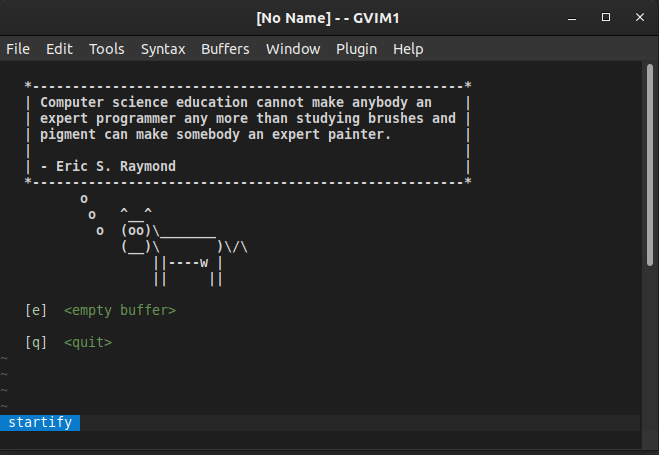

# My Personal VIM Config
# My Neovim Config

## Config is setup using Vim-Plug
To setup vim-plug you can view: https://github.com/junegunn/vim-plug
To download neovim: https://github.com/neovim/neovim/wiki/Installing-Neovim

## Step 1:

For Windows:
Create a folder in C:\Users\AppData\Local\nvim\plugged
Place the ```init.vim``` in this repo alongside this folder.

For Linux:
Place your ```init.vim``` in $HOME/.config/nvim

## Step 2:
For Windows (using Powershell) run:
```
iwr -useb https://raw.githubusercontent.com/junegunn/vim-plug/master/plug.vim |`
    ni "$(@($env:XDG_DATA_HOME, $env:LOCALAPPDATA)[$null -eq $env:XDG_DATA_HOME])/nvim-data/site/autoload/plug.vim" -Force
```

For Linux run:
```
curl -fLo ~/.var/app/io.neovim.nvim/data/nvim/site/autoload/plug.vim --create-dirs \
    https://raw.githubusercontent.com/junegunn/vim-plug/master/plug.vim
```

## Step 3:
Open up neovim via ```nvim``` or ```nvim-qt``` and run ```:PlugInstall```

# For Vim/Gvim

## Step 1:

For Windows:
Place the ```.vimrc``` & ```.gvimrc``` in your ```C:\Users\<your_user>``` directory.

For Linux:
Place your ```.vimrc``` & ```.gvimrc``` in ```$HOME``` or ```~``` directory.

## Step 2:
For Windows (using Powershell) run:
```
iwr -useb https://raw.githubusercontent.com/junegunn/vim-plug/master/plug.vim |`
    ni $HOME/vimfiles/autoload/plug.vim -Force
```

For Unix Systems run:
```
curl -fLo ~/.vim/autoload/plug.vim --create-dirs \
    https://raw.githubusercontent.com/junegunn/vim-plug/master/plug.vim
```

## Step 3:
Open up Vim via ```vim``` or ```gvim``` and run ```:PlugInstall```




# Old Vundle Config way (Recommend using Vim-Plug Methods above)
## Config is setup using Vundle Plugin Manager

To install Vundle:
https://github.com/VundleVim/Vundle.vim

## Step 1:
```
git clone https://github.com/VundleVim/Vundle.vim.git ~/.vim/bundle/Vundle.vim
```
## Step 2:
Copy the ```.vimrc``` in this repo into your ~ folder (root).
```
cp .vimrc ~
```
NOTE: On Windows ```~``` might be something like C:\Users\username\Vim82

## Step 3:
Open Vim and type ```:PluginInstall```

## Step 4 (Optional Config for Gvim):
Add a ```.gvimrc``` in the same directory as ```.vimrc``` and add the same text within that file.

## Step 5:
Save and re-open Vim/Gvim. You should be good to go!


